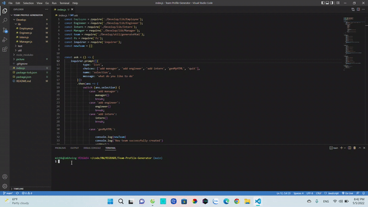
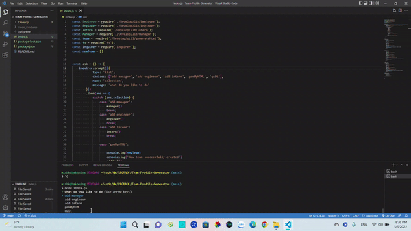

# Team-Profile-Generator

## Badge

## Title
Team Profile Generator
## Table of Contents
- [Team-Profile-Generator](#team-profile-generator)
  - [Badge](#badge)
  - [Title](#title)
  - [Table of Contents](#table-of-contents)
  - [User Story](#user-story)
  - [Desscription](#desscription)
  - [Usage](#usage)
  - [Features](#features)
  - [Tech](#tech)
  - [License](#license)
  - [Testing](#testing)
  - [Link](#link)
  - [Question](#question)
## User Story
AS A manager

I WANT to generate a webpage that displays my team's basic info

SO THAT I have quick access to their emails and GitHub profiles

## Desscription
GIVEN a command-line application that accepts user input

WHEN I am prompted for my team members and their information

THEN an HTML file is generated that displays a nicely formatted team roster based on user input

WHEN I click on an email address in the HTML

THEN my default email program opens and populates the TO field of the email with the address

WHEN I click on the GitHub username

THEN that GitHub profile opens in a new tab

WHEN I start the application

THEN I am prompted to enter the team manager’s name, employee ID, email address, and office number

WHEN I enter the team manager’s name, employee ID, email address, and office number

THEN I am presented with a menu with the option to add an engineer or an intern or to finish building my team

WHEN I select the engineer option

THEN I am prompted to enter the engineer’s name, ID, email, and GitHub username, and I am taken back to the menu

WHEN I select the intern option

THEN I am prompted to enter the intern’s name, ID, email, and school, and I am taken back to the menu

WHEN I decide to finish building my team

THEN I exit the application, and the HTML is generated

## Usage
run npm i

## Features
Add new manager/engineer/intern

Generate new Team profile html

## Tech

HTML, JAVASCRIPT, NODEJS,  INQUIRER, JEST TEST

## License
None

## Testing
Run Test

Generator

## Link
[Github] https://github.com/minhkhoinguy/Team-Profile-Generator

[Video] https://drive.google.com/drive/folders/1e8Gpzw9yes5vGf_fnZIbQGchfzEHITKc

## Question
Contact me with the link below if you have any questions!

[Github](https://github.com/minhkhoinguy)

[Email](mailto:minhkhoinguy@gmail.com)

